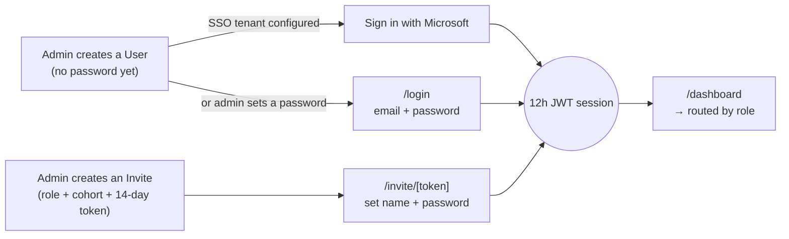
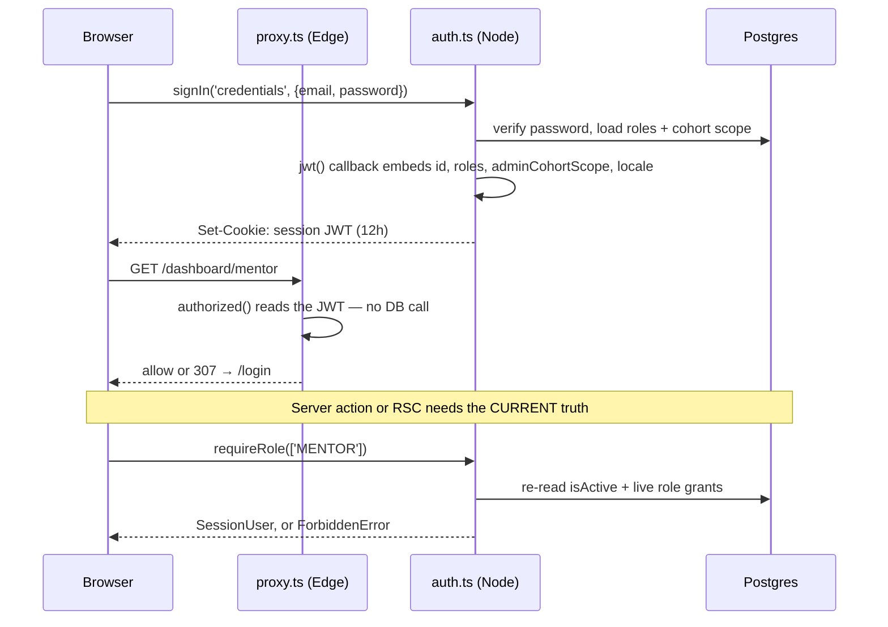
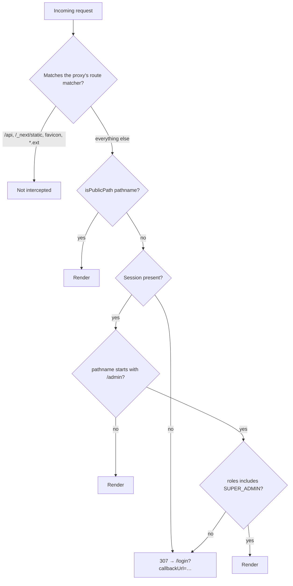

# Authentication

How identity, sessions, and route access work in the BLAK MOH portal. This
covers everything under `src/lib/auth/`, `src/proxy.ts`, and the `(auth)` route
group — not per-action authorization, which is `requireRole()` and covered in
`CLAUDE.md` §3–4.

## In one paragraph

The portal is **invite-only** — there is no self-service signup. An admin
creates an account or sends an invite link; the person either signs in with
that account (email/password, or Microsoft Entra ID SSO if the tenant is
configured) or activates their invite to set a password. Auth.js (NextAuth v5)
issues a 12-hour JWT session. `src/proxy.ts` gates every route at the edge
before a page renders; `requireRole()` gates every server action regardless of
what the edge already allowed, because a JWT is a credential, not a live
authorization source.

## Why two auth files, not one

```
src/lib/auth/
├── auth.config.ts   edge-safe — no Prisma, no bcrypt. Consumed by proxy.ts.
└── auth.ts          Node-only — Prisma adapter, Credentials provider, password
                      verification, role loading.
```

`src/proxy.ts` runs on the Vercel Edge runtime, which cannot load Prisma or
bcrypt. So the config is split: `auth.config.ts` holds only what the edge
needs — the route-gating rule and the session shape — and `auth.ts` layers the
database-backed pieces on top for everywhere else (server actions, RSCs, the
`/api/auth/[...nextauth]` route handler). Next 16 renamed the middleware file
convention from `middleware.ts` to `proxy.ts`; it is the same edge entry point.

## The two identity providers

| | Credentials (email + password) | Microsoft Entra ID (SSO) |
|---|---|---|
| Registered when | always | `MICROSOFT_INTEGRATIONS_ENABLED=true` **and** all three tenant env vars are set (`isEntraConfigured()`, `src/lib/auth/entra.ts`) |
| Where the password lives | `User.passwordHash`, bcrypt, 12 rounds | nowhere — Entra verifies it |
| Account created by | an admin, or invite acceptance | admin pre-creates the `User` row; first SSO sign-in links to it |

**Fail-closed by design.** Entra is off unless *both* an explicit opt-in flag
and a complete credential set are present — a half-configured tenant makes
Auth.js's OIDC discovery throw on init, which would take down email/password
sign-in too if the provider were registered anyway. `isEntraConfigured()` is
checked in exactly two places that must agree: the login page (to hide/show the
SSO button) and `auth.config.ts` (to register/omit the provider). If they ever
disagree, the button appears and errors, or the button is hidden while the
provider still works — so any change to one must be checked against the other.

**Account linking is deliberate, not automatic.** SSO sign-in uses
`allowDangerousEmailAccountLinking: true` — Auth.js's own naming for "trust this
provider's email as already verified." That is safe here specifically because
Entra is a corporate IdP that verifies tenant email ownership; it would not be
safe to flip on for an arbitrary OAuth provider. The point of linking is
CLAUDE.md §2's requirement that an SSO sign-in and an admin-created account for
the same address are *one identity*, not two `User` rows.

## Getting in: three entry points, one destination



There is no fourth path. `/signup` (see `signup/page.tsx`) is a *request
access* page, not a registration form — it either forwards a pasted invite
code to `/invite/[token]` or offers a `mailto:` link to ask an admin. No code
anywhere creates a `User` row from a public form.

### 1 — Credentials sign-in (`(auth)/login`)

`login/actions.ts` calls `signIn('credentials', …)`, which reaches the
`authorize()` callback in `auth.ts`:

1. Validate the input shape (`email`, non-empty `password`) with Zod.
2. Rate-limit on `login:<ip>:<email>` — **5 attempts per 60 seconds**
   (`checkRateLimit`, below).
3. Look up an active, non-deleted user by email; reject if none or if there is
   no `passwordHash` (an SSO-only account has none).
4. `bcrypt.compare` the password.
5. Load the user's roles and admin cohort scope (`loadRoleGrants`) and return
   them as part of the Auth.js `user` object, so the `jwt` callback (below)
   doesn't need a second database round-trip on the very same sign-in.

A rejection at any step returns `null` from `authorize`, which Auth.js turns
into a generic `CredentialsSignin` `AuthError` — the client only ever learns
"invalid," never *which* step failed, so the response can't be used to
enumerate which emails have accounts.

### 2 — Microsoft Entra ID SSO

`signInWithEntra()` (`auth/actions.ts`) calls `signIn('microsoft-entra-id', …)`,
which redirects into Microsoft's own OIDC flow. On return, Auth.js's OAuth
handling — not any code in this repo — matches the verified email to the
existing `User` row via account linking and completes the sign-in. No
credentials ever pass through this app's servers.

### 3 — Invite acceptance (`(auth)/invite/[token]`)

An admin calls `createInvite()` (`src/features/invites/actions.ts`,
`requireRole(ADMIN_ROLES)`-gated), which stores only a **SHA-256 hash** of a
random 32-byte token — never the raw token — with a 14-day expiry
(`generateInviteToken`, `inviteExpiry`, `src/lib/auth/invite.ts`) and a target
role + cohort. Storing a hash means a database leak cannot be replayed into an
accepted invite.

The recipient opens `/invite/<token>`, submits a name and password, and
`acceptInvite()` (`invite/[token]/actions.ts`):

1. Rate-limits on `invite-accept:<ip>` — 10/minute.
2. Re-derives the hash from the URL token and looks up the invite; rejects if
   missing, soft-deleted, not `PENDING`, or past `expiresAt`.
3. In one transaction: upserts the `User` (creating it if the invite predates
   any account, or activating/renaming an existing one), grants the invite's
   role scoped to the invite's cohort, and marks the invite `ACCEPTED`.
4. Signs the new user straight in with `signIn('credentials', …)` — one
   fewer step for someone who just proved control of the token and set a
   password in the same request.

Password reset (`(auth)/forgot-password` → `(auth)/reset-password/[token]`)
follows the identical hash-token shape via `src/lib/auth/token.ts`, with one
difference worth calling out: the request endpoint **always** returns "sent,"
regardless of whether the email matches an account, so the response itself
cannot be used to enumerate registered addresses.

## The session



- **Strategy: JWT, not database sessions** (`session: { strategy: 'jwt' }`,
  `auth.config.ts`). The token itself carries `id`, `roles`,
  `adminCohortScope`, and `locale`, set once at sign-in by the `jwt()`
  callback in `auth.ts` and copied onto the client-visible session by the
  edge-safe `session()` callback in `auth.config.ts`. This is what lets the
  edge `authorized()` check make a decision without a database call.
- **12-hour lifetime**, an explicit shortening of Auth.js's 30-day default —
  deliberate for an internal tool, not an oversight.
- **The JWT is a credential, not a live authorization source.** Everywhere
  that actually matters — every server action, every RSC data read —
  re-reads the user from the database (`getCurrentUser()` /
  `requireRole()`, `src/lib/auth/rbac.ts`) rather than trusting the roles
  baked into the token. That is why deactivating a user or changing their
  role takes effect on their very next request instead of waiting up to 12
  hours for the token to expire, and it's the reason two systems exist at
  all rather than one:

  | | `proxy.ts` (edge) | `requireRole()` (`rbac.ts`, Node) |
  |---|---|---|
  | Reads | the JWT only | the database, every call |
  | Decides | *can this pathname render at all* | *can this specific action run* |
  | Granularity | coarse — `/admin/*` vs. everything else | fine — exact roles, exact cohort |
  | Staleness | up to 12h if a role changes mid-session | none |

  A stale JWT can get someone *past the edge gate* onto a page whose shell
  then renders nothing useful, but it can never let them successfully run
  an action their current, freshly-read database role doesn't permit.

- **`trigger === 'update'`** re-runs `loadRoleGrants` inside the same 12-hour
  token without a full re-login — used when something needs the JWT's own
  claims refreshed without forcing a sign-out.

## Route gating at the edge (`src/proxy.ts`)



`authorized()` in `auth.config.ts` is the entire rule. `isPublicPath()` is an
explicit allowlist, not a denylist — new routes are gated by default, which
fails closed:

- `/`, `/login`, `/signup`, `/forgot-password`, `/reset-password/*`,
  `/invite/*`, `/maintenance`, `/api/auth/*`
- The Knowledge Library — `/about`, `/faq`, `/confidentiality`, `/contact`,
  `/programme`, `/mentor-guide`, `/mentee-guide`
- `/opengraph-image*` — Next's generated social-preview image. It has to be
  public because a link-unfurler fetches it with no session at all; gating it
  would turn every shared link's preview into a login redirect.
- `/design` — the component gallery — but **only outside production**
  (`NODE_ENV !== 'production'`). In production it requires a session like
  everything else.

Two route names are deliberately *not* on this list, on purpose: `/support`
(the private, authenticated support-request workflow) is intentionally
distinct from the *public* support page at `/contact` — that naming collision
is the entire reason the public page isn't just called `/support`.

Beyond the public allowlist, gating is binary at the edge: signed-in or not,
and — only for `/admin/*` — does the JWT's role list include `SUPER_ADMIN`.
Everything finer (which mentee a mentor may see, which cohort an admin may
touch) is a `requireRole()` / `assertCohortAccess()` decision made against the
database inside the action itself, never at the edge.

**`src/proxy.ts` also builds the per-request CSP nonce**, wrapping
`NextAuth(authConfig).auth` from the outside rather than using the
`auth((req) => …)` wrapper form. That distinction matters more than it looks:
passing a middleware function to `.auth()` makes next-auth skip its own
`!authorized` branch — the one that produces the redirect to `/login` — so
wrapping it that way would silently disable the entire route gate while every
test still passed. See `src/lib/security/csp.ts` for the CSP side of that
file; this document only cares that the auth decision inside it is untouched.

## Roles and cohort scope

Three roles today (`src/lib/auth/roles.ts`) — `SUPER_ADMIN`, `MENTOR`,
`MENTEE`. The programme brief's Programme Admin, Trainer, and Reviewer roles
were folded into Super Admin; their capabilities are Super-Admin-only rather
than separate roles.

An admin's reach can be narrower than "every admin action everywhere."
`AdminCohortScope` (`src/lib/auth/scope.ts`) is either `'ALL'` (a role grant
with `cohortId: null` — a global admin) or an explicit list of cohort ids (a
cohort-scoped admin, i.e. this system's equivalent of a Programme Admin for
one specific cohort). `adminCohortFilter()` turns that into a Prisma `where`
fragment for list queries, and `assertCohortAccess()` throws `ForbiddenError`
for a single-record check — an *empty* scope list resolves to `{ in: [] }`,
which matches nothing, so cohort scoping fails closed rather than open.

## Password and token storage

| What | How | Where |
|---|---|---|
| Login password | bcrypt, 12 rounds | `User.passwordHash` |
| Invite token | SHA-256 of a random 32-byte value; only the hash is stored | `Invite.tokenHash` |
| Password-reset token | same shape, 60-minute expiry | `PasswordResetToken.tokenHash` |

Both token flows invalidate prior outstanding tokens for the same user before
issuing (or immediately after consuming) a new one, so an old reset link or a
resent invite can't be replayed alongside a newer one.

## Rate limiting

Every public auth endpoint that accepts a credential guess or a token is
throttled — login (5/min per IP+email), invite acceptance (10/min per IP),
password-reset request (5/min per IP+email), and password-reset submission
(10/min per IP). The limiter itself (`src/lib/auth/rate-limit.ts`) is a pure,
dependency-free fixed-window counter so it stays unit-testable without any
runtime behind it; `rate-limit-shared.ts` wraps it with an optional
Upstash-Redis-backed shared counter for multi-instance deployments, and
**fails open** (falls back to the in-memory limiter) if Redis is unreachable —
availability over strictness, since rate limiting is one defense among several
on these routes, not the only one.

## Where to look for what

| Question | File |
|---|---|
| Is this route public? | `isPublicPath()`, `src/lib/auth/auth.config.ts` |
| What's actually in the session/JWT? | `session()` / `jwt()` callbacks, `auth.config.ts` + `auth.ts` |
| Is Entra SSO available right now? | `isEntraConfigured()`, `src/lib/auth/entra.ts` |
| Can this user run this action? | `requireRole()`, `src/lib/auth/rbac.ts` |
| Can this admin touch this cohort? | `assertCohortAccess()`, `src/lib/auth/rbac.ts` + `scope.ts` |
| How do invites/resets generate their tokens? | `src/lib/auth/invite.ts`, `src/lib/auth/token.ts` |
| Where does a page redirect an anonymous visitor? | `requirePageUser()`, `src/lib/auth/page-user.ts` (redirects — never throws — because a thrown auth error during RSC soft-navigation surfaces as Next's generic error screen instead of a clean redirect) |
